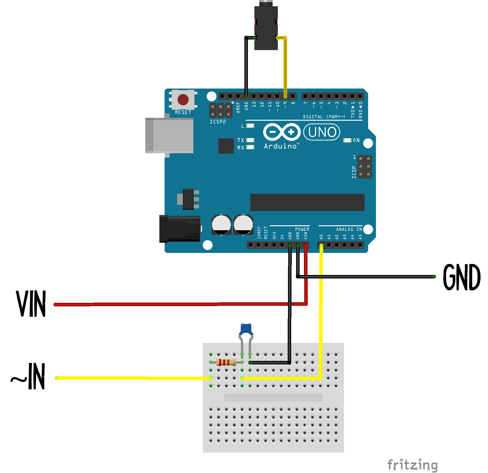

 

The outputs of the galileo are shown in the diagram below:

The galileo can output two types of signal: *Digital* on/off signals, and *Analog* continuous signals (labelled PWM) - think of it like the difference between a regular light-switch and a dimmer switch.

The board can output *digital* signals on any of its pins (labelled 0-13). It can only output an *analog* signal on pins marked with a "***~***" (pronounced 'tilde'), so that's pins ~3, ~5, ~6, ~9, ~10 and ~11.

## Light-Emitting Diode (LED)
 

An LED is a simple example of an analog output: the light can either be off completely or any brightness up to a maximum. LED circuits need a resistor in them in order to limit the current passing through the LED - this stops it from overheating and blowing up! 

It's also important to put the LED in the right way around. You'll notice that one leg of the LED is longer than the other - this end must go on the *positive* side of the circuit, and the other goes on the *negative* end.

## Servo (includes the robot arm)
 

A servo is a lot like a motor, but instead of being designed to turn with as much *power* as possible, it's designed to turn with as much *accuracy* as possible. As a result, it doesn't turn full circle. Instead it turns half a circle, from 0 to 180 degrees.

The robot arms on some of the galileos are just three of these mounted inside a 3d-printed armature. You can decide which inputs control which servos using Connect Anything - try and see if you can pick something up, or do a robot dance!

## LED ring output
 

The LED rings on some of the galileos are controlled by arduino UNOs. This circuit shows you that you can control other microcomputers from your galileo!

The UNO reads the analog signals that you send it, which control the colour and brightness of the LED ring.

## Audio output
 

The speakers on some of the galileos are also controlled by arduino UNOs. They use the [Mozzi library](https://sensorium.github.io/Mozzi/) to generate sounds using the analog signals you send from the Galileo. Hook them up using Connect Anything and see what noises they can make! 

