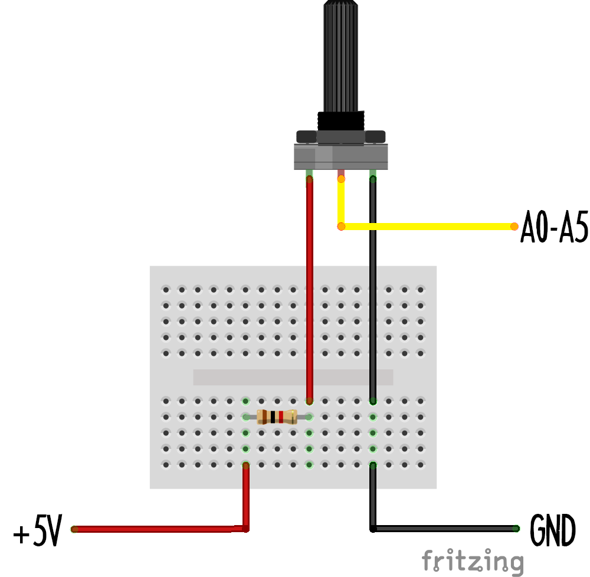

 

The galileo can receive and send many different types of signal on many of its different pins. The pins we're going to be using today to receive signals are shown below:

These pins can recieve voltages between 0 and 5 Volts: If you attach a device that outputs any voltage between those values to any of these pins, that voltage will be displayed on the "inputs" display on the Connect Anything website.

## Push button
 

This push button circuit will send either an ON or OFF signal to the Galileo. This will show up in Connect Anything as either a FULL or EMPTY bar. This circuit is pretty simple, all it does is connect a voltage to the Galileo input when the switch is pressed (ON). When the switch is released, a resistor drains off charge from the analog input so that it can go back to zero volts (OFF): 

This is the basic principle of many on/off switches!

## Potentiometer (A.K.A. variable resistor)
 

Potentiometers are used in all sorts of electronics applications, from the volume knobs on your hi-fi to the sensors in your joysticks. By turning the knob on the supplied potentiometer, you are changing the amount of resistance in the electronic circuit. This means that more or less voltage is read at the galileo's input.

## Light Dependent Resistor (LDR) input
 

LDRs change their resistance depending on how much light shines on their surface. They can be used to measure light levels in a variety of applications, from weather stations to morse decoders. As the resistance changes, more or less voltage is read at the analog input.

## Range sensor (Arduino) input
 

This range sensor is controlled by an arduino UNO. This circuit demonstrates that you can use your galileo to read signals from other microcomputers! The range sensor works using bat-like ultrasound: it sends out an inaudible beep and waits until it hears the echo. The longer it takes to hear the echo, the further away the object that the sound wave hit is!

The UNO measures the time delay and converts that to an analog signal, the circuit on the breadboard is called a "low-pass-filter" and it **smooths** the signal sent out so that it can be read clearly by the galileo.